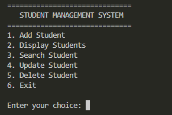
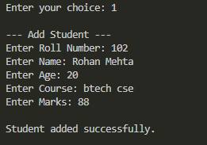
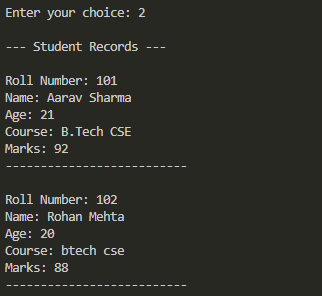

# Student Management System

## C++ Programming Internship - Task 1

This project is a console-based Student Management System developed in C++.

The program manages student records using file handling and menu-driven operations.

## Features

- Add a new student
- Display all student records
- Search student by roll number
- Update student information
- Delete student records
- Store student data permanently using file handling

## Technologies Used

- C++
- Object-Oriented Programming
- File Handling
- String Streams

## Concepts Used

- Classes and Objects
- Functions
- File Streams
- Loops
- Conditional Statements
- Switch Case
- CRUD Operations

## How to Compile

```bash
g++ main.cpp -o student


## How to Run

After compiling the program, run the executable using:

```bash
student.exe
```

On Windows, you can also use:

```bash
.\student.exe
```

## Project Objective

The objective of this project is to develop a console-based Student Management System in C++ that can efficiently manage student records using file handling and menu-driven operations.

The application allows users to add, view, search, update, and delete student information while storing the records persistently in a text file.

## File Structure

```text
Task-01-Student-Management-System/
│
├── main.cpp
├── students.txt
└── README.md
```

- `main.cpp` - Contains the complete C++ source code.
- `students.txt` - Stores student records.
- `README.md` - Contains project information and instructions.

## Sample Operations

The application provides the following menu options:

1. Add Student
2. Display Students
3. Search Student
4. Update Student
5. Delete Student
6. Exit

## Author

Developed as part of the C++ Programming Virtual Internship at Thiranex.

## Screenshots

### Main Menu


### Adding a Student


### Displaying Student Records
