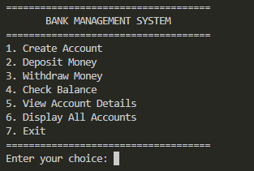
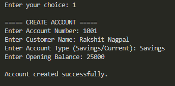
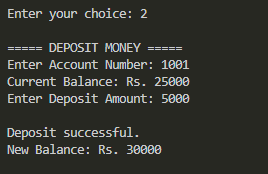
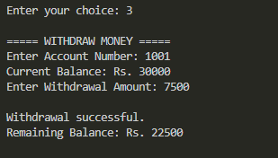
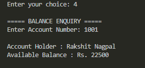
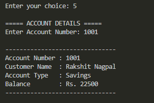

# Bank Management Application

## C++ Programming Internship - Task 2

This project is a console-based Bank Management Application developed in C++.

The application manages customer bank accounts and performs basic banking operations using object-oriented programming and file handling.

## Features

- Create a new bank account
- Deposit money
- Withdraw money
- Check account balance
- View account details
- Display all bank accounts
- Persistent storage of customer records

## Technologies Used

- C++
- Object-Oriented Programming
- File Handling
- String Streams

## Concepts Used

- Classes and Objects
- Encapsulation
- Constructors
- Functions
- File Streams
- Conditional Statements
- Loops
- Switch Case
- Data Persistence

## How to Compile

```bash
g++ main.cpp -o bank
```

## How to Run

On Windows:

```bash
bank.exe
```

or:

```bash
.\bank.exe
```

## Project Objective

The objective of this project is to develop a console-based Bank Management Application using C++.

The application allows users to create and manage customer accounts, deposit and withdraw money, check account balances, and view account information. Customer records are stored in a file so that the data remains available even after the program is closed.

## File Structure

```text
Task-02-Bank-Management-Application/
│
├── main.cpp
├── accounts.txt
├── README.md
└── screenshots/
```

- `main.cpp` - Contains the C++ source code.
- `accounts.txt` - Stores customer account information.
- `README.md` - Contains project documentation.
- `screenshots/` - Contains screenshots demonstrating the application.

## Application Menu

The application provides the following options:

1. Create Account
2. Deposit Money
3. Withdraw Money
4. Check Balance
5. View Account Details
6. Display All Accounts
7. Exit

## Screenshots

### Main Menu



### Create Account



### Deposit Money



### Withdraw Money



### Balance Enquiry



### Account Details



## Author

Developed as part of the C++ Programming Virtual Internship at Thiranex.