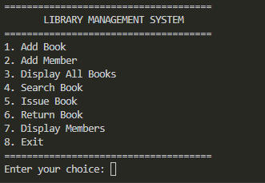
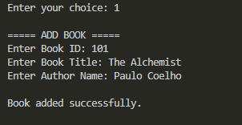
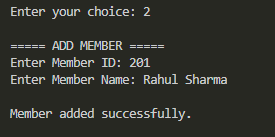
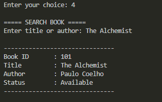
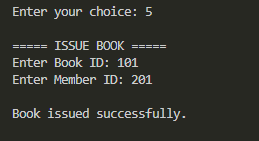
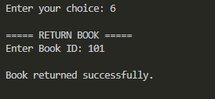

# Library Management System

A console-based **Library Management System** developed in C++ as part of the **Thiranex C++ Internship Program**.

The application provides a simple way to manage books and library members while supporting book searching, issuing, returning, and persistent storage using text files.

---

## Project Objective

The objective of this project is to develop a functional Library Management System using C++ and Object-Oriented Programming concepts.

The system is designed to manage basic library operations such as:

- Adding books
- Adding members
- Displaying books
- Searching for books
- Issuing books
- Returning books
- Maintaining book availability
- Saving records using file handling

---

## Features

### Book Management

- Add new books to the library
- Store a unique Book ID
- Store book title
- Store author name
- Track book availability
- Display stored books

### Member Management

- Register new library members
- Store a unique Member ID
- Store member name

### Search Functionality

Books can be searched using:

- Book title
- Author name

### Book Issue System

The system allows a book to be issued to a registered member.

Before issuing a book, the application verifies:

- The book exists
- The member exists
- The book is currently available

After a successful issue, the availability status of the book is updated.

### Book Return System

The system allows an issued book to be returned.

After a successful return:

- The book status is updated
- The book becomes available for borrowing again

### Persistent Data Storage

The application uses text files to store book and member records.

This means the saved information remains available even after the application is closed and started again.

---

## Technologies Used

- C++
- Object-Oriented Programming
- File Handling
- Standard Template Library
- GCC / G++
- Visual Studio Code
- Git
- GitHub

---

## C++ Concepts Used

The project demonstrates the use of several C++ concepts, including:

- Classes and Objects
- Functions
- Constructors
- Strings
- Loops
- Conditional Statements
- File Input and Output
- Searching Records
- Data Validation
- Object-Oriented Programming
- Persistent Data Storage

---

## Project Structure

    Task-03-Library-Management-System/
    |
    |-- main.cpp
    |-- books.txt
    |-- members.txt
    |-- .gitignore
    |-- README.md
    |
    `-- screenshots/
        |-- main-menu.png
        |-- add-book.png
        |-- add-member.png
        |-- search-book.png
        |-- issue-book.png
        `-- return-book.png

---

## How to Compile

Open a terminal inside the `Task-03-Library-Management-System` directory and run:

    g++ main.cpp -o library

On Windows, this generates:

    library.exe

---

## How to Run

After successful compilation, run:

    .\library.exe

Alternatively, in Windows Command Prompt:

    library.exe

---

## Example Book

The following book was used while testing the application:

    Book ID : 101
    Title   : The Alchemist
    Author  : Paulo Coelho

---

## Example Member

The following member was used while testing:

    Member ID   : 201
    Member Name : Rahul Sharma

---

## Example Workflow

A typical workflow of the application is:

1. Start the Library Management System.
2. Add a new book.
3. Register a new library member.
4. Search for the book using its title or author.
5. Issue the book to the registered member.
6. Return the issued book.
7. Exit the application.
8. Start the application again.
9. Search for the previously saved book to verify data persistence.

---

# Screenshots

The following screenshots demonstrate the major features of the application.

## Main Menu

The main menu provides access to the different Library Management System operations.

---

## Add Book

A new book is added to the library with its Book ID, title, and author information.

---

## Add Member

A new library member is registered with a Member ID and name.

---

## Search Book

The search functionality allows stored books to be found using their title or author.

---

## Issue Book

A registered member can borrow an available book using the Book ID and Member ID.

---

## Return Book

An issued book can be returned, after which its status becomes available again.

---

## Data Storage

The application uses text files for persistent storage.

### books.txt

The `books.txt` file stores book-related information such as:

- Book ID
- Book title
- Author name
- Availability status

### members.txt

The `members.txt` file stores member-related information such as:

- Member ID
- Member name

Because the information is stored in files, records remain available after restarting the program.

---

## Git Ignore

Generated executable and object files are excluded from the Git repository using `.gitignore`.

The `.gitignore` file contains:

    *.exe
    *.o

This prevents compiled files such as `library.exe` from being committed to the repository.

---

## Testing

The application was tested for the following operations:

- Adding a book
- Adding a member
- Displaying stored books
- Searching for a book
- Issuing an available book
- Returning an issued book
- Updating book availability
- Retaining saved information after restarting the application

---

## Expected Outcome

The completed application provides a functional Library Management System capable of:

- Managing book records
- Managing member records
- Searching for books by title or author
- Processing book issues
- Processing book returns
- Tracking book availability
- Storing records using text files
- Retaining records between program executions

---

## Learning Outcomes

Through this project, I practiced and improved my understanding of:

- C++ programming
- Object-Oriented Programming
- Classes and objects
- Functions
- File handling
- Data persistence
- Searching and updating records
- Application flow management
- Organizing a C++ project
- Compiling C++ programs using G++
- Using Git and GitHub for version control

---

## Task

**Task 03 - Library Management System**

Developed as part of the **Thiranex C++ Internship Program**.