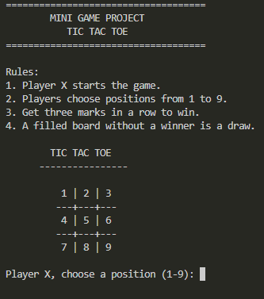
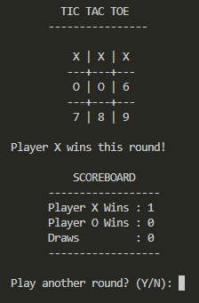
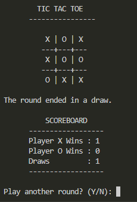
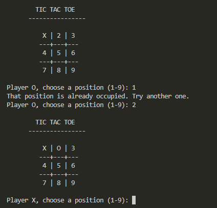
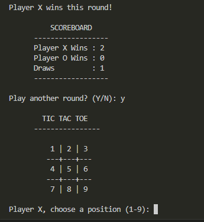

# Tic Tac Toe - Mini Game Project

A console-based **Tic Tac Toe game developed in C++** as part of the **Thiranex C++ Internship Program**.

The project demonstrates core programming concepts such as loops, arrays, conditional statements, functions, input validation, and game logic.

---

## Project Objective

The objective of this project is to create an interactive console-based mini game in C++.

The game allows two players to play Tic Tac Toe using the same keyboard and includes:

- Dynamic board updates
- Turn management
- Win detection
- Draw detection
- Invalid move handling
- Replay functionality
- Score tracking between rounds

---

## Features

### Two Player Gameplay

The game supports two players:

- Player X
- Player O

Player X starts each new round.

---

### Dynamic Game Board

The board is displayed after every move.

At the beginning of each round, the board contains positions from 1 to 9:

    1 | 2 | 3
    --+---+--
    4 | 5 | 6
    --+---+--
    7 | 8 | 9

Players select a position by entering a number from 1 to 9.

---

### Win Detection

The application checks all possible winning combinations after each move.

A player wins by placing three matching symbols in:

- A horizontal row
- A vertical column
- A diagonal line

There are eight possible winning combinations.

---

### Draw Detection

If all nine board positions are occupied and neither player has won, the round is declared a draw.

---

### Input Validation

The game validates player input and handles:

- Numbers outside the range 1 to 9
- Non-numeric input
- Positions that are already occupied

An invalid move is rejected and the player is asked to choose another position.

---

### Replay Functionality

After every completed round, the players are asked:

    Play another round? (Y/N):

Entering `Y` starts a new round with a fresh board.

Entering `N` ends the game.

---

### Scoreboard

The application keeps track of results while the program is running.

The scoreboard records:

- Player X wins
- Player O wins
- Draws

The board resets during replay while the scoreboard is retained.

---

## Technologies Used

- C++
- Object-Oriented Programming
- Arrays
- Loops
- Conditional Statements
- Functions
- Standard Library
- GCC / G++
- Visual Studio Code
- Git
- GitHub

---

## C++ Concepts Used

This project demonstrates:

- Classes and Objects
- Arrays
- Functions
- Constructors
- Loops
- Conditional Statements
- Input Validation
- Boolean Logic
- Character Data
- Game State Management
- Encapsulation
- Console Input and Output

---

## Project Structure

    Task-04-Tic-Tac-Toe/
    |
    |-- main.cpp
    |-- README.md
    |-- .gitignore
    |
    `-- screenshots/
        |-- main-screen.png
        |-- player-x-win.png
        |-- draw-game.png
        |-- invalid-move.png
        `-- replay-game.png

---

## How to Compile

Open a terminal inside the `Task-04-Tic-Tac-Toe` folder and run:

    g++ main.cpp -o tictactoe

On Windows, this creates:

    tictactoe.exe

---

## How to Run

After successful compilation, run:

    .\tictactoe.exe

Alternatively, in Windows Command Prompt:

    tictactoe.exe

---

## How to Play

1. Start the program.
2. Player X begins the round.
3. Choose an available position from 1 to 9.
4. Player O then chooses an available position.
5. Players continue taking turns.
6. The game checks for a winner after every move.
7. If the board becomes full without a winner, the game ends in a draw.
8. After the round, choose whether to play again.

---

# Screenshots

The following screenshots demonstrate the major features of the application.

---

## Main Game Screen

The initial screen displays the game title, rules, and numbered Tic Tac Toe board.

---

## Player X Win

This screenshot demonstrates the win-detection functionality when Player X completes a winning combination.

---

## Draw Game

This screenshot demonstrates draw detection when all board positions are filled without either player winning.

---

## Invalid Move Handling

The application prevents a player from selecting a board position that is already occupied.

---

## Replay Game

After a completed round, the player can choose to start another game.

The board resets while the existing scoreboard remains available.

---

## Game Logic

The board is stored using an array of nine positions.

The program checks the following eight winning combinations:

    0 1 2
    3 4 5
    6 7 8

    0 3 6
    1 4 7
    2 5 8

    0 4 8
    2 4 6

After each move, the program checks whether the current player occupies all three positions in any winning combination.

---

## Input Handling

Player input is validated before a move is accepted.

A move is rejected if:

- The entered value is not a number
- The number is less than 1
- The number is greater than 9
- The selected position is already occupied

This prevents invalid input from affecting the game state.

---

## Testing

The application was tested for:

- Successful compilation
- Starting a new game
- Player X moves
- Player O moves
- Dynamic board updates
- Horizontal win detection
- Draw detection
- Invalid occupied-position handling
- Replay functionality
- Board reset
- Scoreboard updates

---

## Git Ignore

Generated executable and object files are excluded from the Git repository using `.gitignore`.

The `.gitignore` file contains:

    *.exe
    *.o

This prevents compiled files such as `tictactoe.exe` from being uploaded to GitHub.

---

## Expected Outcome

The completed project provides an interactive console-based Tic Tac Toe game featuring:

- Dynamic board display
- Two-player gameplay
- Turn-based input
- Win detection
- Draw detection
- Input validation
- Replay functionality
- Score tracking

---

## Learning Outcomes

Through this project, I practiced and improved my understanding of:

- C++ programming
- Arrays
- Loops
- Conditional logic
- Functions
- Classes and objects
- Input validation
- Game logic
- State management
- Problem solving
- Compiling C++ programs using G++
- Git and GitHub version control

---

## Task

**Task 04 - Mini Game Project (Tic Tac Toe)**

Developed as part of the **Thiranex C++ Internship Program**.